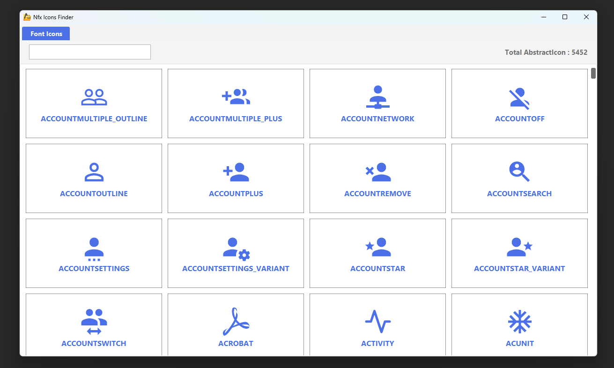

# NFX Icons Library

Welcome to **NFX Icons**, a powerful and easy-to-use icon library featuring **5,400 high-quality icons**! This library is designed for seamless integration into JavaFX applications, offering both programmatic and CSS-based customization.

## 🚀 Features
- **5400+ icons** to enhance your UI
- **Simple API** for easy usage
- **Customizable size and name** via Java code or CSS

## 🎨 Customization
- **-nfx-icon-name** → Changes the icon dynamically
- **-nfx-icon-size** → Adjusts the icon size

## 1️⃣ Creating an Icon
```java
import xss.it.nfx.icons.Icon;

// Create an icon instance
Icon icon = new Icon("BELL");
icon.setSize(20); 
```
## 2️⃣ Using CSS Properties

```css
.my-icon {
    -nfx-icon-name: "BELL";
    -nfx-icon-size: 20;
}
```
## 🔍 Check out the Demo
To run the demo class xss.it.demo.Demo, use the following Gradle command:
```groovy
gradle run
```

## 📸 Icons Finder Preview


***
## 🤝 Feedback
All are welcome to use and provide feedback on this library!
Help improve NFX Icons by reporting issues or suggesting new features.

***
### This library is free to use in any project!

### Enjoy coding with NFX Icons! 🎉
